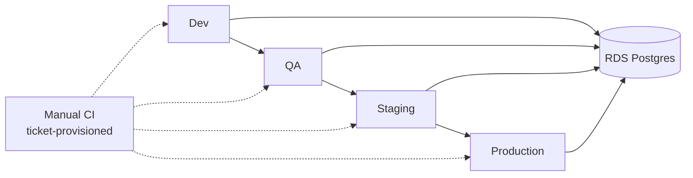
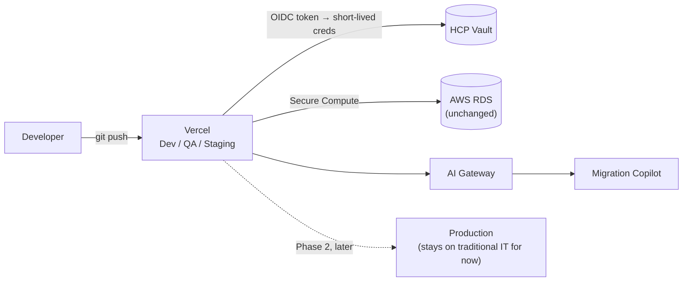

# Meridian Capital — Portfolio Watchlist (Vercel SA Take-Home Demo)

A bank's customer-facing portfolio app, plus a **Migration Copilot** — a
durable AI agent that helps the legacy IT admins behind it plan and
execute their own move to Vercel, and then *runs the config it generates*
to prove it works.

**Live demo:** https://meridian-migration-demo.vercel.app — one click to
sign in; the password is on the page. **Start with the admin account**
(marked *Start here*): it's where the platform work is.

### The 60-second tour

1. Sign in as `admin@meridiancapital.demo` → ask *"What should we migrate
   first?"* The agent runs as a durable Workflow: each tool call is a
   replayable step, the stream survives a refresh, and a cheap classifier
   decides per-turn whether the question needs the frontier model.
2. Ask it to *"generate the migration config for /watchlist"*. The run
   **pauses for your approval** — emitting routing config for a bank's
   traffic is where a human belongs.
3. Approve it. The generated `next.config.ts` is then **executed inside a
   Vercel Sandbox**, which calls its `rewrites()` and asserts the route
   table it actually produces. You get a verdict, not a promise.
4. Sign in as `jordan.reyes@meridiancapital.demo` for the customer side:
   holdings, P&L, price alerts, and a cached AI insight.

### What it's built on

[Workflows](https://vercel.com/docs/workflows) · [Sandbox](https://vercel.com/docs/sandbox) ·
[AI Gateway](https://vercel.com/docs/ai-gateway) · [BotID](https://vercel.com/docs/botid) ·
Cache Components (PPR) · Marketplace Postgres + Drizzle · HCP Vault OIDC
(dynamic DB credentials, no static password)

**[`ARCHITECTURE.md`](./ARCHITECTURE.md) is the short version** — one
paragraph per primitive, naming the file that uses it and the specific
problem it solved, trade-offs included.
[`solution-architecture.md`](./solution-architecture.md) is the full
design doc: target-state architecture, the OIDC boundary-crossing pattern
between Vercel and AWS/HCP Vault, and the migration/rollout plan. This
README is the how.

**Repo:** https://github.com/FraserPol/meridian-migration-demo (this repo)

**Deploying this yourself?** Two paths, not three — see "Deploying to
Vercel" below for which one you want:
[`SETUP_INSTRUCTIONS.md`](./SETUP_INSTRUCTIONS.md) (fast, free Neon
Postgres, no AWS/HCP account) or
[`PRODUCTION_SETUP.md`](./PRODUCTION_SETUP.md) (the real thing — Terraform,
AWS RDS + HCP Vault, dynamic credentials).

## Architecture at a glance

The full versions of both diagrams — every primitive, the 5-step OIDC
boundary-crossing walk, trade-offs — are in
[`solution-architecture.md`](./solution-architecture.md#2-current-state-architecture).
These are the simplified cut: what changes, at a glance.

**Current state** — four environments, all owned and provisioned by
traditional IT, promoted one at a time through a manual CI gate:



**Target state** — Dev/QA/Staging move to Vercel (Production stays on
traditional IT for this phase); RDS and Vault stay exactly where they are,
reached over Secure Compute with short-lived OIDC-issued credentials
instead of static secrets:



## Demo accounts

Password for all three: **`VercelDemo!2026`**

| Email | Role | What it shows |
|---|---|---|
| `jordan.reyes@meridiancapital.demo` | customer | Already onboarded, populated watchlist (AAPL, MSFT, TSLA) |
| `alex.chen@meridiancapital.demo` | customer | Account exists, no profile yet — the onboarding/"create a profile" flow |
| `admin@meridiancapital.demo` | admin | Redirects straight to the Migration Copilot |

These are created by `npm run db:seed` (see below) — not present until you run it.

## What's here

```
app/                    Next.js App Router
  layout.tsx            Root layout — mounts <Analytics/> and <SpeedInsights/>
  login/                Credentials-based login (jose-signed session cookie)
  dashboard/             Customer-facing: profile + watchlist
  admin/migration-copilot/  Admin-only: the AI SDK + AI Gateway chat tool
  api/quotes/            Mocked "existing AWS-hosted market-data API"
  api/legacy-inventory/  Mocked "existing AWS/EKS route inventory" (admin-only, curl-able)
  api/chat/              Streaming AI SDK route backing the Migration Copilot
lib/
  session.ts            Session cookie signing/verification (jose)
  password.ts           Password hashing (bcryptjs) — split from session.ts, see its comment
  vault.ts              OIDC → Vault → dynamic DB credential resolution (+ local fallback)
  db/                   Drizzle ORM schema + lazy connection resolution
  quotes.ts             Deterministic mock quote generator
  legacy-inventory.ts   Mocked legacy route/component inventory, cached with "use cache"
  ai/                   Migration Copilot: system prompt, tools (durable steps), deterministic planner
workflows/
  migration-copilot/    The Migration Copilot as a durable Vercel Workflow (AI SDK WorkflowAgent)
proxy.ts                 Auth gating for /dashboard, /admin — Next.js 16's middleware.ts rename
infra/terraform/         AWS + HCP Vault + Vercel infrastructure (see its own README)
.github/workflows/ci.yml GitHub Actions: lint, typecheck, migration dry-run, build
```

## Running it locally

```bash
npm install
cp .env.example .env.local   # fill in AUTH_SECRET at minimum
docker compose up -d          # local Postgres, standing in for AWS RDS
npm run db:generate           # generate SQL from lib/db/schema.ts (already committed under drizzle/)
npm run db:migrate            # apply it
npm run db:seed               # create the three demo accounts above
npm run dev
```

Open http://localhost:3000 and sign in with any of the demo accounts.

**AI Gateway locally:** the Migration Copilot needs either an
`AI_GATEWAY_API_KEY` in `.env.local`, or a Vercel OIDC token pulled via
`vercel env pull` (see `.env.example` for both options). Without either,
`/api/chat` will return an auth error from AI Gateway — the rest of the
app works fine without it.

## Deploying to Vercel

Two complete paths — pick one, don't mix steps between them:

- **Fast, public URL, no AWS/HCP account needed:**
  [`SETUP_INSTRUCTIONS.md`](./SETUP_INSTRUCTIONS.md) — free Neon Postgres,
  `vercel deploy --prod` by hand. `DATABASE_URL` stays set for production;
  that's the intended, correct state for this path (see "Two ways to run
  this app" below).
- **The real thing:** [`PRODUCTION_SETUP.md`](./PRODUCTION_SETUP.md) — the
  architecture `solution-architecture.md` actually describes: Terraform,
  AWS RDS + HCP Vault, dynamic credentials. `DATABASE_URL` gets explicitly
  unset once Vault takes over (Step 8) — also the intended, correct state
  for this path, and the opposite of the fast path above. If you're
  seeing a `DATABASE_URL`/`VAULT_ADDR` collision, it's because these two
  paths got mixed; pick one and follow it start to finish.

Either way, once deployed, AI Gateway authenticates automatically via the
project's Vercel OIDC token — no `AI_GATEWAY_API_KEY` needed in
production, though your Vercel team still needs a payment method on file
before AI Gateway will serve requests at all, even free-tier ones — see
Known Limitations.

**Frontend observability out of the box — backend is a separate story.**
`@vercel/analytics` and `@vercel/speed-insights` are both wired into
`app/layout.tsx` — page views and Core Web Vitals start showing up under
the project's **Analytics** and **Speed Insights** dashboard tabs once
real traffic hits the deployment, no further setup needed. That's RUM
(real-user monitoring), not backend error tracking: a Server Action or
API route crash today only reaches `app/error.tsx`/`global-error.tsx`
(both just `console.error` — no Sentry/Datadog/Log Drain is wired up, see
Known Limitations) and Vercel's own raw Function logs, not any alerting
or dashboard this project set up. This is separate from the Migration
Copilot's own AI Gateway spend/audit tracking described below.

## Two ways to run this app, on purpose

`lib/vault.ts` supports two paths, and which one is active is controlled
entirely by which environment variables are set:

1. **`DATABASE_URL` is set** (local dev, and this is what `docker-compose`
   + `.env.example` give you out of the box) → the app connects straight
   to Postgres with a static connection string. This is the fallback
   explicitly called out in `solution-architecture.md` Section 3.
2. **`VAULT_ADDR` is set instead** (what `infra/terraform` provisions) →
   every request/build resolves a fresh, TTL-bound Postgres credential
   from HCP Vault's database secrets engine, authenticated via the
   Vercel-issued OIDC token — no static secret anywhere. This is the
   production path the architecture doc describes.

Both paths run the exact same application code above `lib/vault.ts` — the
point of the abstraction is that nothing in `lib/db/index.ts` or any page
needs to know which one is active.

`lib/session.ts`'s session-signing secret follows the identical pattern,
one level up: `AUTH_SECRET` set directly (local dev, or `SETUP_INSTRUCTIONS.md`'s
quick path) vs. resolved from Vault's KV-v2 static-secrets mount when only
`VAULT_ADDR` is set (`lib/vault.ts`'s `getAuthSecret()`) — the "application
secrets and configuration secrets" half of the Vault requirement, as
distinct from the dynamic DB credentials above. Every request/build that
needs it (session creation, verification, and `proxy.ts`'s auth gate) has
to thread the incoming request's headers through to `getAuthSecret()`,
since that's how a Vercel Function receives its OIDC token at runtime
(`x-vercel-oidc-token`, not the `VERCEL_OIDC_TOKEN` env var — that's
build-time only).

## The Migration Copilot, briefly

Ask it things like:

- "What should we migrate first?"
- "How do we move `/watchlist` to Vercel?"
- "Walk me through migrating `/api/profile` safely."

It always calls `getLegacyRouteInventory` before discussing a route,
`recommendStrategyForRoute` before proposing a strategy, and
`generateMigrationConfig` before showing any code — the strategy logic and
generated `next.config.ts` / `proxy.ts` / `nginx.conf` snippets are
plain deterministic TypeScript (`lib/ai/migration-planner.ts`), not
model-generated text. The model's job is orchestration and explanation,
not writing infrastructure config from scratch — see the comment at the
top of that file for the reasoning.

The agent itself is defined once, as an AI SDK `WorkflowAgent`
(`workflows/migration-copilot/workflow.ts`) rather than inlined into the
route handler — the model, instructions, tools, and stop condition live
in one place. `app/api/chat/route.ts` just `start()`s the workflow and
pipes its stream back to the client, converting the agent's raw
model-call stream to the UI message protocol at that boundary
(`createModelCallToUIChunkTransform()`). Model calls route through AI Gateway
with provider-level failover ordering and per-request cost tagging (set
directly in the workflow's `providerOptions.gateway`) — if the primary
provider serving the selected model degrades, the Gateway routes to the
next one in `order` with no code change.

**Cost-aware step-up routing.** Before the agent's model is even chosen, a
durable step (`lib/ai/routing.ts`) classifies the turn with a fast/cheap
model (`anthropic/claude-haiku-4.5`) — most questions ("what routes exist?",
"what's the traffic on `/watchlist`?") don't need frontier-model reasoning.
Only turns asking for a migration recommendation or generated config
escalate to the frontier model (`anthropic/claude-sonnet-4.5`). This also
sets `providerOptions.gateway.models` (cross-model fallback, distinct from
`order`'s same-model provider failover): the fast tier escalates to the
frontier model if it becomes unavailable rather than losing the request;
the frontier tier fails over to a different provider entirely
(`openai/gpt-5.4`). Both the classifier's and the agent's model calls are
tagged (`tier:fast`/`tier:frontier`) so the AI Gateway dashboard shows
classifier spend as a near-zero line item relative to agent spend, if
step-up routing is doing its job.

**Is it actually worth it? A real number, with a caveat.** The only usage
this has seen so far is 6 runs from manual testing (2026-08-13): the
classifier routed 2 of 6 to the fast tier, and re-pricing those two runs'
actual token counts at the frontier rate instead shows roughly $0.018–$0.020
saved per fast-tier hit, against a classifier call that costs an estimated
$0.0003–$0.0006 regardless of outcome. That's a large enough margin that
this design is hard to make net-negative even at a much lower hit rate — a
miss only costs one cheap classification call, while a hit saves the gap
between Haiku and Sonnet pricing (Sonnet output is 15x Haiku's per token).
But n=6 from one dev session isn't production traffic, so call this a
**validated pattern, not a proven optimization** until real usage volume
exists to check it against. `migration_copilot_runs.classifier_input_tokens`
/ `classifier_output_tokens` / `classifier_cost_usd` (added specifically so
this becomes a real query instead of an estimate) make that check possible
once there's enough traffic to trust — the total-run columns alone
(`input_tokens`/`output_tokens`/`estimated_cost_usd`) don't separate
classifier spend from agent spend, so verifying this claim before those
columns existed required estimating the classifier's prompt size by hand,
not querying it.

**Why a Workflow, not a plain Route Handler:** the whole tool-calling loop
(inventory → strategy → config) used to run inside one Function
invocation with nothing persisted server-side — a crash or redeploy
mid-loop lost everything. Each tool's `execute` (`lib/ai/tools.ts`) is now
a durable Vercel Workflow step (`"use step"`), with automatic retries and
a result that's persisted and replayed rather than re-executed if the run
is interrupted. `WorkflowAgent` (from `@ai-sdk/workflow` — AI SDK 7's
replacement for the Workflow SDK's `DurableAgent`, which this project used
until 2026-09 — not the plain `ToolLoopAgent`) is what makes this actually
work — every tool call it
makes happens directly from the `"use workflow"` function's own call
stack, not from inside another step, which matters because a step calling
another step collapses into one non-durable unit (`"use step"` becomes a
no-op when it's not called directly from a workflow function).

**Failure handling.** Every way a run can fail — the classifier erroring,
AI Gateway exhausting its whole fallback list, a thrown tool or model
error — ends the same way: the workflow writes an `error` part to the
stream and closes it itself (the agent is started with `sendFinish:
false, preventClose: true` so it can't close the stream first without
one), which flips the chat UI to its error state instead of leaving it on
"Thinking…" indefinitely; then the audit row is still written, with
`error_message` set, so failed runs show up in the audit trail (⚠️ in the
Recent runs table) instead of vanishing from it. Verified end-to-end
against a local Postgres with no Gateway credentials configured: the
client receives a proper `error` event, the stream closes, and a
failed-run row lands with the real Gateway error message.

**Audit trail and cost, made visible, not just claimed.** Every run writes
a row to `migration_copilot_runs` (`lib/db/schema.ts`) — who asked, every
tool call in order, which provider actually served each model call
(real proof of Gateway failover if it ever happens mid-run), token usage,
and an estimated cost (`lib/ai/pricing.ts` — an estimate; Gateway's own
dashboard is the source of truth for billed cost). `chat-panel.tsx` polls
`app/api/migration-copilot/runs` after each turn and shows a compact
recent-runs table, so "AI Gateway gives Finance/Compliance a spend/trace
record" (`solution-architecture.md`) is something to click through live
rather than a claim about a dashboard nobody in the room can see.

There's also an admin-only toggle ("Trigger live model failover for this
message") that forces a *real* failure, not a narrated one: it deliberately
breaks the primary model slug so `providerOptions.gateway.models` — the
step-up routing's cross-model fallback list above, not `order` — has to
serve the response for real. This relies on AI Gateway's documented
behavior for that option ("fallback model list if primary model
unavailable") applying to an invalid/nonexistent slug the same way it
applies to a model that's merely down; `order`'s same-model provider
failover can't be fault-injected this way (an invalid provider ID there is
a config error Gateway rejects outright), but `models` is a different
mechanism and is documented to behave differently. **Verified live**
(2026-08-13, `scripts/verify-gateway-fallback.ts`) — it does fall through.
Runs made with the toggle on are badged (🔧) in the audit table above; the
Provider/Tier columns there show whichever model actually served the
response — the fallback, not the primary.

Two real production bugs surfaced and got fixed along the way: the audit
trail's "which provider served this" column was silently wrong from the
moment the feature was built (it read the *requested* model, not the one
Gateway actually routed to), and the Migration Copilot didn't work in
production at all until 2026-08-13 (a Terraform-provisioned Vercel project
setting defaulted to `false`, crashing every real chat message on a
read-only-filesystem write). Full write-up of both, including root cause
and how each was found, in [`NOTES.md`](./NOTES.md); the second one's
symptoms and fix are also in `PRODUCTION_SETUP.md`'s Troubleshooting
section.

## Known limitations (what I'd flag before anyone relies on this)

- **AI Gateway requires a payment method on file for the Vercel team**,
  even to use free-tier credits — without one, the Migration Copilot's
  chat stream starts (the UI shows "thinking") and then silently fails
  with a 403 (`customer_verification_required`) that isn't surfaced in the
  chat UI. Add a card under Vercel dashboard → your team → **AI** →
  **Add credit card**. Not something Terraform or application code can
  route around. Fixed as of 2026-08-13 for this team. There's a second,
  separate layer behind it: a card on file alone doesn't unlock every
  model — some (`openai/gpt-5.5` and `anthropic/claude-haiku-4.5` both hit
  this) return a distinct 403 ("Free tier users do not have access to this
  model") until the team also has actual paid credits, not just a verified
  card — see the top-up link in that error's message.
- **Cache Components (`next.config.ts`'s `cacheComponents: true`) is
  enabled but only fully adopted on one code path.** Every authenticated
  page reads the session cookie and does a live, per-user DB read — there
  is no static shell to serve a signed-out visitor, so those segments
  opt out of instant-navigation validation with `export const instant =
  false` (the officially documented incremental-adoption pattern) rather
  than being forced into a Suspense-per-layout rewrite of a working auth
  flow. The one genuinely cacheable read — the legacy route inventory the
  Migration Copilot advises on (`lib/legacy-inventory.ts`) — uses `"use
  cache"` + `cacheLife("max")` for real, since in production that's a
  CMDB export that changes on a change-management cadence, not per
  request. `/login` needed no changes: it was already a static shell.
- **`ai` is back on `7.x`, via `@ai-sdk/workflow@1.x` rather than `2.x`.**
  History: an earlier iteration used `ai@7` for `ToolLoopAgent`; adopting
  Vercel Workflow's `DurableAgent` for real durability forced a downgrade
  to `ai@6`, because every published `@workflow/ai` version peer-depends
  on `ai@^6`. AI SDK 7 then moved the durable agent into the AI SDK itself
  as `WorkflowAgent` (`@ai-sdk/workflow`), and this project migrated to it
  (2026-09), returning to `ai@7`. The newest `@ai-sdk/workflow` line (2.x)
  requires `workflow@^5`, which is still beta, so this pins the last 1.x
  (`1.0.70`), which runs on the stable `workflow@4.8` already in use —
  upgrade both together once `workflow@5` is stable. The migration also
  removed a quiet version split: `@ai-sdk/react@4` had already been
  resolving its own `ai@7` for the client while the server was on `ai@6`;
  everything now dedupes to one `ai` copy. AI Gateway's cross-model
  fallback (`models: [...]`) and same-model provider failover
  (`order: [...]`) are unchanged; `order: ["anthropic", "bedrock"]` is
  what's used — see the comment in `workflow.ts` for why Anthropic's
  direct API is first.
- **Terraform has since been applied for real** against live AWS/HCP/Vercel
  accounts (not just `validate`/`plan`), which surfaced several bugs hand
  review alone missed — an output comparing a possibly-`null` value against
  `""`, an OIDC audience/environment claim mismatch that would have made
  Vault/AWS auth silently fail for every real deployment, and HCP Vault
  Dedicated's requirement that every request carry an `X-Vault-Namespace:
  admin` header (root is reserved for HashiCorp's platform operations).
  All fixed; see `infra/terraform/README.md` and `PRODUCTION_SETUP.md`'s
  Troubleshooting section for the specifics of each.
- **Vercel Secure Compute is Enterprise-only.** The architecture in
  `solution-architecture.md` calls for it to give the deployed app private
  network access to Vault/RDS; on Hobby/Pro it's unavailable (`Contact
  Sales`). `PRODUCTION_SETUP.md`'s Step 6 documents the demo-only
  workaround (public endpoints + TLS/credential auth instead of network
  isolation) and the actual production recommendation.
- **The legacy route inventory is static mock data.** In production the
  Migration Copilot's first tool call would hit a real internal endpoint;
  the tool-calling code path is identical either way, but the data itself
  doesn't reflect a real EKS deployment.
- **All three demo accounts share one password.** Fine for a public
  take-home repo with no real data behind it; would never fly for an
  actual Meridian deployment.
- **This demo doesn't implement Rolling Releases or a canary rollout** —
  that's a project-level Vercel setting, not application code, and is
  covered in `solution-architecture.md`'s rollout plan instead.
- **No connection pooler in front of Postgres, and no connection math done
  to justify that.** `lib/db/index.ts` opens a direct `postgres` client per
  warm Function instance (`max: 5`) straight against RDS — fine at demo
  scale, but there's no RDS Proxy or pgBouncer in front of it, and nobody's
  worked out `max Function instances × 5` against RDS's actual connection
  limit. At real concurrency this is how you exhaust Postgres connections
  during a traffic spike; a pooler (RDS Proxy pairs naturally with the
  Vault-issued dynamic credentials already in use) is the fix before this
  goes anywhere near production traffic.
- **The CSP in `next.config.ts` allows `'unsafe-inline'` for `script-src`/
  `style-src`.** This app doesn't nonce-wire Next.js's inline bootstrap/
  hydration scripts or styled-jsx, so a strict CSP would break the app.
  The headers still cover HSTS, frame-busting, MIME-sniffing, and referrer
  leakage — real gaps for a bank scenario — but a from-scratch hardening
  pass would add a per-request nonce and drop both `'unsafe-inline'`
  entries.
- **No real backend observability.** `app/error.tsx`/`global-error.tsx`
  catch uncaught errors and give the user a real page instead of Next.js's
  bare default fallback, but both just `console.error` — nothing forwards
  server-side errors anywhere a team would actually see them. No Sentry,
  no Datadog, no Vercel Log Drain. For a bank scenario this is a real gap,
  not a placeholder: it needs an external service decision (which
  provider, what alerting policy, what's PII-safe to send off-platform)
  that's genuinely out of scope for a demo repo, not just an unwired hook
  like `cacheTag` above.

## Development tooling

Built with Claude (Sonnet) in an agentic coding session, working file-by-file
with the actual repo rather than generating it blind — schema, auth,
Vault client, AI tools, and Terraform were each reviewed and adjusted
individually, and the full production Terraform path was later applied
against live AWS/HCP/Vercel accounts and debugged end to end (see Known
Limitations and `infra/terraform/README.md`) rather than left as
untested hand-review. AI behavior in the Migration Copilot was validated
by: confirming the recommendation/config-generation logic is deterministic
TypeScript rather than model output (see `lib/ai/migration-planner.ts`),
and `lib/ai/migration-copilot.eval.test.ts` — 5 fixed prompts run against
the real model on every CI run, asserting the tool-call order (inventory
before strategy, strategy before config) the system prompt requires,
rather than a one-time manual check (`npm run test:eval`; needs
`AI_GATEWAY_API_KEY` set as a repo secret — skips gracefully, not a CI
failure, if it isn't).

**Skills-assisted review pass:** a later pass installed and applied a set
of Claude Code skills — `next-best-practices`, `vercel-react-best-practices`,
`vercel-composition-patterns`, `next-cache-components`, `web-design-guidelines`,
`workflow`, `ai-sdk`, and `terraform-skill` — against the whole repo, checking
it against each area's own documented best practices instead of ad hoc
reading. That surfaced and fixed real gaps: `SessionUnavailableError`
handling that covered some Server Components/Actions but not others
(`lib/vault.ts`'s `VaultUnavailableError` now covers both the session-key
and DB-credential paths, consistently), two accessibility gaps (form
errors with no `aria-live` announcement, a per-row "Remove" button with
no accessible name distinguishing which ticker it targets), and — found
only by testing the fix live with a real authenticated session rather
than trusting HTTP status codes — a caching bug where `/` served a
build-time-baked "redirect to /login" to every visitor regardless of
session. Fixed by wrapping the redirect logic in a `<Suspense>` boundary
so Cache Components treats it as a genuine per-request dynamic hole
instead of a statically cacheable outcome (see `app/page.tsx`).

**On the commit history:** the first 9 commits share identical timestamps
(~11K additions landing as one batch). That's the initial scaffold from
one agent session, committed as a single unit rather than split into a
fabricated-looking sequence of "incremental" commits that didn't actually
happen incrementally. The real evolution — the part worth reading — is in
the fix-heavy commits from day two onward: real bugs, found and fixed one
at a time (see `NOTES.md` and the Known Limitations above for the
detailed version of several of them).
