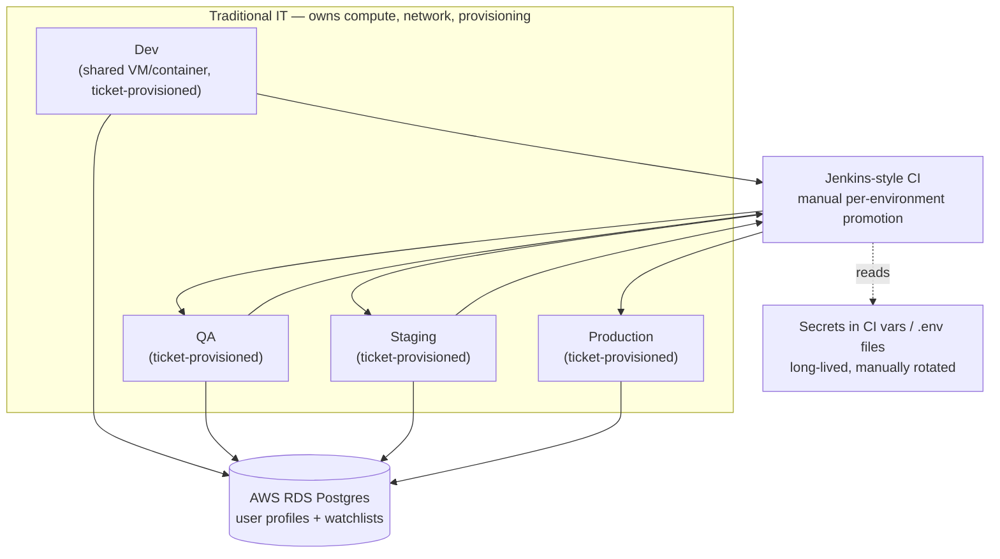
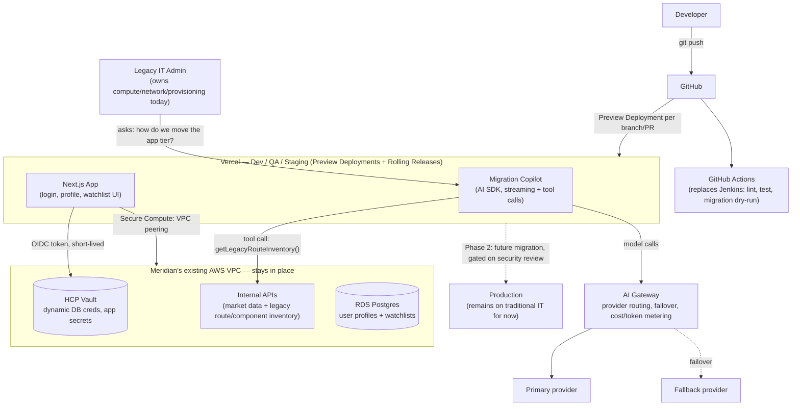

# Meridian Capital — Portfolio Watchlist App: Vercel Solution Architecture

**Customer profile:** Fortune 2000 regulated financial services firm ("Meridian Capital").
**App:** Next.js app where clients log in, create a profile, and track a personal stock watchlist/portfolio.
**Prepared by:** Fraser Pollock, Solutions Architect

---

## 1. Problem Statement

Meridian's traditional IT organization owns compute, network, and provisioning end-to-end across four environments — Dev, QA, Staging, and Production. Every environment is stood up and changed through IT ticketing, and the release pipeline promotes one environment at a time.

**Where it hurts:**

- **Environment provisioning is slow and manual.** Spinning up or resizing Dev/QA/Staging infrastructure goes through a ticket queue measured in days, not minutes. Engineers share a single contended Dev environment instead of getting an isolated environment per branch or PR.
- **Releases are big-bang and hard to undo.** Promotion between environments is a manual deploy; rollback means a second manual deploy, not an instant switch. A bad QA/Staging promotion costs an on-call engineer 30–60 minutes to unwind.
- **Secrets sprawl is a standing audit finding.** Database credentials and third-party API keys live in CI variables and `.env` files, are long-lived, and are rotated on a manual schedule (or not at all). This is exactly the kind of finding that shows up in a SOC 2 / GLBA Safeguards Rule audit.
- **No AI cost attribution.** Meridian wants to add an AI-powered feature but Finance and Compliance have no way to see what a model call costs or which provider served it — a hard blocker for anything AI-related in a regulated shop.
- **The people who'd have to execute this migration aren't sold on it.** The traditional IT admins who own compute, network, and provisioning today have no reason to trust a new platform they haven't touched. Without a low-risk way to see, hands-on, how much easier their own migration work becomes, adoption stalls at the admin layer regardless of what engineering wants.

**Business consequence:** slower feature velocity, recurring audit findings tied to static credentials, engineering time lost to ticket queues instead of building, no path to ship an AI feature that Compliance will sign off on, and a change-management risk if the admin team is routed around instead of brought along.

---

## 2. Current-State Architecture

**Why this is painful, concretely:** the same secret store, the same manual promotion gate, and the same ticket queue sit in front of every environment — including the three lower environments where the business wants to move fast and experiment safely.

---

## 3. Vercel's Role

This is primarily a **Replace + Connect** engagement, with an **Augment** move for the AI feature:

- **Replace** the release-and-provisioning layer for Dev, QA, and Staging — the undifferentiated ops work of standing up environments, wiring CI promotion, and building rollback tooling by hand. **GitHub Actions replaces Jenkins** for CI checks (lint, test, migration dry-runs); Vercel's native Git integration handles the actual deployment and promotion, so CI no longer needs to orchestrate deploys at all.
- **Connect** the Vercel-hosted app securely to the two systems Meridian's security org has mandated must not move: **HCP Vault** (secrets) and **AWS RDS Postgres** (data).
- **Augment** the app with an AI-stack primitive built specifically for the audience most skeptical of this move: a **Migration Copilot**, aimed at the legacy IT admins who currently own compute, network, and provisioning. Rather than pitching them a slide deck, we hand them a tool that teaches, component by component, how their own front end and app tier move from AWS to Vercel — using [Vercel's incremental migration patterns](https://vercel.com/docs/incremental-migration) (vertical/horizontal/hybrid, fallback rewrites, instant kill-switch). This is the wedge: let the admins experience Vercel's ease and feasibility firsthand, on their own migration, before asking them to trust it with Production.

**Deliberately out of scope:** Production stays on traditional IT for this phase. Regulated customers do not move their production trust boundary on the first engagement — Dev/QA/Staging is the proof period; Production migration is a distinct, later phase gated on a successful Staging soak and a security review of the patterns below under real traffic.

### Target-State Architecture

**How the boundary crossing actually works (this is the part Security will ask about):**

1. A Vercel Function never holds a static AWS key or a static Vault token. On invocation, Vercel issues a short-lived, signed **OIDC token** (`VERCEL_OIDC_TOKEN` / `x-vercel-oidc-token`) scoped to that project and environment.
2. **HCP Vault trusts Vercel as an OIDC issuer** via Vault's `jwt` auth method — the same pattern used to trust GitHub Actions or any external OIDC IdP. The function exchanges its Vercel OIDC token for a short-lived Vault token, then reads a dynamic, TTL-bound database credential from Vault's database secrets engine — never a standing password.
3. **Secure Compute** gives Vercel a dedicated, isolated network with a VPC peering connection into Meridian's existing AWS VPC, so RDS and the internal APIs are never exposed to the public internet and never need an IP allowlist maintained by hand.
4. The same OIDC pattern can hand the function short-lived AWS credentials directly (`AssumeRoleWithWebIdentity`) if a call needs to reach an AWS-native service rather than going through Vault.
5. The Migration Copilot's `getLegacyRouteInventory()` tool call rides the same Secure Compute path as the app's own data fetches — it is a read against the existing AWS environment, never a write, and it never touches Production.

---

## 4. Vercel Primitives Chosen (3)

| # | Primitive | Role | Why this one |
|---|-----------|------|---------------|
| 1 | **Preview Deployments + Rolling Releases** | Replace | Every PR gets an immutable, isolated URL — no more shared, contended Dev environment. QA and Staging become alias domains fed by a gradual, percentage-based rollout with **instant rollback** to the still-live prior deployment, replacing the manual 30–60 minute unwind. |
| 2 | **AI SDK + AI Gateway** *(AI-stack requirement)* | Augment | The **Migration Copilot** is a chat surface, built with AI SDK, aimed at the legacy IT admin team. Given a route or component (e.g., "the watchlist page" or "the profile API"), it tool-calls a mocked inventory of the existing AWS/EKS-hosted app, recommends a [vertical, horizontal, or hybrid incremental migration strategy](https://vercel.com/docs/incremental-migration), and generates the actual `next.config.ts` fallback/rewrite (or nginx `proxy_pass`) snippet plus the Global Config kill-switch pattern for instant rollback. AI Gateway sits behind it for one API across providers, automatic failover if a provider degrades, and a spend/token dashboard Finance and Compliance can review per feature — before this ever reaches Production. |
| 3 | **Secure Compute (VPC peering) + OIDC Federation** | Connect | Gives the app a private, static network path into Meridian's AWS VPC for RDS and the internal APIs (market data + legacy route inventory), and lets both AWS and HCP Vault trust short-lived Vercel-issued identity tokens instead of long-lived secrets sitting in Vercel environment variables. |

**Trade-offs accepted:**

- Rolling Releases require the app to tolerate two versions serving traffic simultaneously during a canary window — the team needs to keep schema/API changes backward-compatible for the rollout duration.
- AI Gateway failover assumes the fallback provider has comparable behavior for the tool-calling pattern in use; this needs a small eval set to confirm before it's trusted for a real cutover, not just for Dev/QA.
- The Migration Copilot **proposes** rewrite/proxy configuration — it does not commit or deploy it. An admin still reviews and merges the generated snippet. This keeps a human in the loop for any change to routing, which is exactly the control a regulated admin team will ask for.
- Secure Compute is an Enterprise-tier feature with a real cost and setup lead time (VPC peering approval on the AWS side) — this is a Phase 1 investment, not a free add-on.
- Replacing Jenkins with GitHub Actions only works because CI's job shrinks to checks (lint/test/migration dry-run) — Vercel's Git integration, not Actions, owns the actual deploy. Teams with heavy Jenkins-specific pipeline logic (approvals, custom gates) need to re-home that logic, not just swap the runner.

---

## 5. What Stays Outside Vercel, and Why

| System | Stays on | Why |
|---|---|---|
| **User profiles, watchlists, portfolio positions** | AWS RDS Postgres | Already encrypted, backed up, and inside Meridian's existing compliance attestations. Re-platforming the system of record is unnecessary risk for zero benefit. |
| **App secrets, DB credentials, provider keys** | HCP Vault | Vault is Meridian's existing, audited secrets control plane. Vercel becomes a *consumer* of Vault via short-lived dynamic credentials — it does not replace it. |
| **End-user identity/SSO** | Existing IdP (Okta/Azure AD) | Login continues through the existing OIDC/SAML IdP into the Next.js app. MFA, conditional access, and audit logging investments are preserved untouched. |
| **Production environment** | Traditional IT | Phase 1 proves the pattern in Dev/QA/Staging. Moving the production trust boundary is a separate, later decision gated on a security review of Vault + Secure Compute under real traffic. |
| **Market-data entitlement systems, core banking/back-office** | AWS / on-prem | Out of scope for this app; untouched. |
| **CI checks (lint, test, migration dry-runs)** | GitHub Actions | Replaces Jenkins for verification work; deployment itself is owned by Vercel's native Git integration, not by CI, so the two responsibilities stay cleanly separated. |

---

## 6. What Changes (Success Measures)

**Technical:**
- Environment provisioning: ticket queue (days) → preview URL on `git push` (minutes).
- Secrets: long-lived, manually-rotated → dynamic, TTL-bound Vault credentials, zero static DB secrets in Vercel.
- Rollback: manual redeploy (~30–60 min) → instant rollback to a still-live prior deployment (seconds).
- AI spend: no visibility → per-request/per-feature cost and token dashboard in AI Gateway.
- Migration guidance: manual, tribal-knowledge cutover planning → an AI-generated, reviewable rewrite/rollback plan per route.

**Business:**
- Faster PR-to-QA-testable cycle time for the three lower environments.
- Fewer recurring audit findings tied to secret sprawl and static credentials.
- Less engineering time lost to infra ticket queues.
- A defensible cost and failover story Compliance can approve *before* an AI feature is considered for Production.
- Legacy admins get a self-serve, hands-on way to see their own migration work simplified — turning the team most likely to resist this change into internal champions instead of blockers.

---

## 7. Rollout Plan (Dev/QA/Staging)

1. **Preview** — Connect the repo to Vercel; every PR gets a Preview Deployment wired to Vault (dev-scoped dynamic credentials) and a non-production RDS instance/schema over Secure Compute.
2. **Validation** — GitHub Actions runs lint/test/migration dry-run checks as a required status check; merges to `main` auto-promote to the QA alias domain via Vercel's Git integration, and a small manual eval set validates the Migration Copilot's tool calls and failover behavior.
3. **Canary** — Staging promotion goes through Rolling Releases at a small traffic percentage (e.g., 10%) behind the Staging alias.
4. **Cutover** — Percentage increased to 100% once error rate, latency, and AI Gateway cost/quality metrics hold steady.
5. **Rollback** — Any regression triggers an instant rollback to the prior deployment; no rebuild, no redeploy, no ticket.

Production migration is intentionally **not** in this plan — it is the Phase 2 conversation once Staging has soaked and Security has reviewed the OIDC/Vault/Secure Compute pattern under real traffic.

---

## 8. Known Limitations and Risks (what I'd tell Meridian before kickoff)

- Secure Compute + VPC peering has AWS-side approval steps and an Enterprise-plan cost — this is not a same-day setup.
- Rolling Releases assume backward-compatible changes during the canary window; a breaking schema change needs a different rollout strategy.
- AI Gateway failover quality needs a small regression/eval set before it's trusted beyond Dev/QA — "same model, different provider" is not always truly identical in practice.
- The Migration Copilot is only as good as the mocked legacy inventory it reads from in the demo; in production it needs a real (even lightweight) source of truth for routes/components, or its recommendations will drift from reality.
- This design intentionally leaves Production on traditional IT; it does not solve Meridian's Production release pain yet. That's the natural next engagement once this phase proves out.

---

## Working Demo

The demo is built and live, in this same repo: **[github.com/FraserPol/meridian-migration-demo](https://github.com/FraserPol/meridian-migration-demo)**, pushed and deployed. It's a working Next.js app (login, profile, watchlist), the Migration Copilot (AI SDK + AI Gateway, tool-calling a mocked legacy route inventory), Terraform for the AWS/HCP Vault infrastructure, and a GitHub Actions CI workflow. The top-level `README.md` has setup steps, demo credentials, and known limitations.

The Terraform has since been applied for real against live AWS/HCP/Vercel accounts — not just hand-reviewed — which surfaced and fixed several bugs `terraform validate`/`plan` alone wouldn't catch (an OIDC audience/environment claim mismatch, HCP Vault Dedicated's `admin/` namespace requirement, and two application-side gaps where Vault-backed secrets were never actually wired up to read from Vault at runtime). See `README.md` and `infra/terraform/README.md` for specifics.
